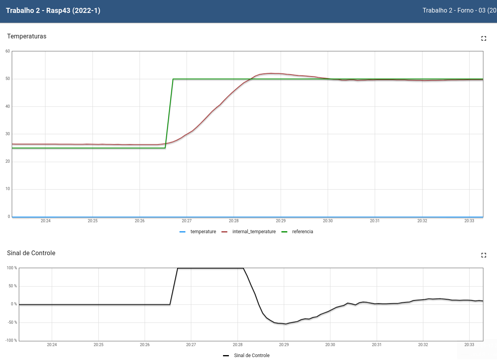
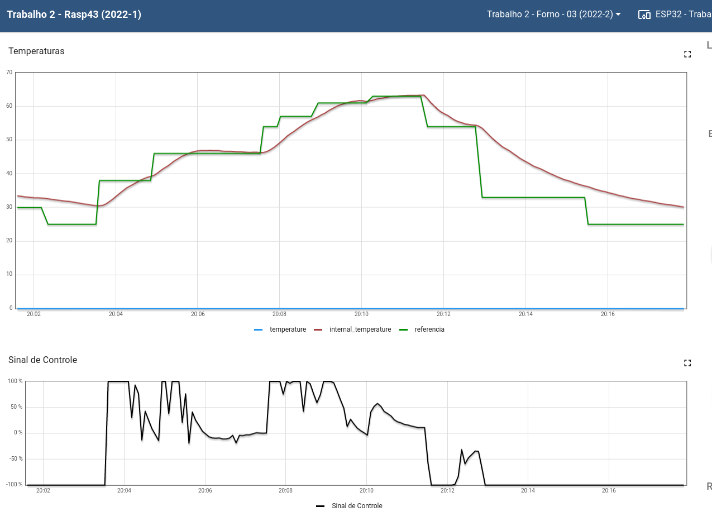

# Trabalho 2

Aluno: Paulo Batista | 180054554

### Sobre

Trabalho 2 da disciplina de Fundamentos de Sistemas Embarcados (2022/2)


### Como executar

Para executar use o makefile, a seguir estão os comandos necessário:

* Limpa alguma compilação prévia:

```bash
make clean
```

* Compila os scripts do projeto

```bash
make all
```

* Executa a aplicação

```bash
make run
```

### Gráfico de referência fixa



### Gráfico curva pré-defenida


